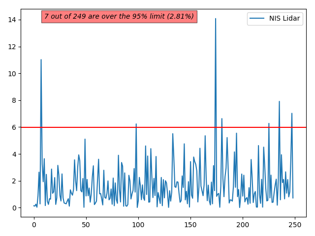
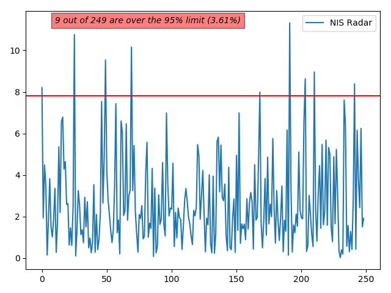

# CarND-P07-UnscentedKalmanFilters

CarND-P07-UnscentedKalmanFilters implements a sensor fusion algorithm of
radar and lidar measurements to estimate the state of a moving object
using Unscented Kalman Filters. 

## File Structure
### C++ Source Files - /src
- **[Eigen/](src/Eigen/)** - C++ library for linear algebra, matrix and
    vector opeartions
- **[main.cpp](src/main.cpp)** - runs WebSocket server to interact with 
    the Term 2 simulator.  It receives measurement data from the simulator,
    estimates the state, computes RMSE, and returns the results back to the
    simulator.
- **[ukf.cpp](src/ukf.cpp)** - implements UKF algorithm; `Prediction`,
    Lidar and Radar measurement `Update`
- **[tools.cpp](src/tools.cpp)** - defines functions to calculate Root Mean
    Square Error (RMSE)
### Other Support Files
- **[plot-nis/](plot-nis/)** - Python script to plot NIS, and resulting plot
    images
- **[CMakeLists.txt](CMakeLists.txt)** - CMake file
- **[data/obj_pose-laser-radar-synthetic-input.txt](data/obj_pose-laser-radar-synthetic-input.txt)** -
    a copy of one of the sample data files used by the simulator
- **[docs/input_file_format.txt](docs/input_file_format.txt)** - 
    explains input data file format

## Getting Started
### [Download ZIP](https://github.com/gabeoh/CarND-P07-UnscentedKalmanFilters/archive/master.zip) or Git Clone
```
git clone https://github.com/gabeoh/CarND-P07-UnscentedKalmanFilters.git
```

### Install uWebSockets
Run the installation script from the project repository. 
- [uWebSockets](https://github.com/uNetworking/uWebSockets)
#### Linux Installation
```
./install-ubuntu.sh
```
#### Mac Installation
```
./install-mac.sh
```

### Download Simulator
- [Udacity Self-Driving Car - Term 2 Simulator](https://github.com/udacity/self-driving-car-sim/releases/)

### Dependencies
* cmake >= 3.5
  * All OSes: [click here for installation instructions](https://cmake.org/install/)
* make >= 4.1 (Linux, Mac), 3.81 (Windows)
  * Linux: make is installed by default on most Linux distros
  * Mac: [install Xcode command line tools to get make](https://developer.apple.com/xcode/features/)
  * Windows: [Click here for installation instructions](http://gnuwin32.sourceforge.net/packages/make.htm)
* gcc/g++ >= 5.4
  * Linux: gcc / g++ is installed by default on most Linux distros
  * Mac: same deal as make - [install Xcode command line tools](https://developer.apple.com/xcode/features/)
  * Windows: recommend using [MinGW](http://www.mingw.org/)

### Build and Run
1. Make a build directory: `mkdir build && cd build`
1. Generate Makefile: `cmake ..`
1. Compile: `make` 
1. Run it: `./ExtendedKF`

## Results
### Results from Dataset1
#### Parameter Settings
| std_a_   | std_yawdd_ |
|:--------:|:----------:|
| 3.0      | 0.75       |

#### Root Mean Squre Error (RMSE)
| rmse_x   | rmse_y   | rmse_vx  | rmse_vy  |
|:--------:|:--------:|:--------:|:--------:|
| 0.0732   | 0.0849   | 0.3796   | 0.2388   |

#### NIS Lidar


#### NIS Radar


## License
Licensed under [MIT](LICENSE) License.
